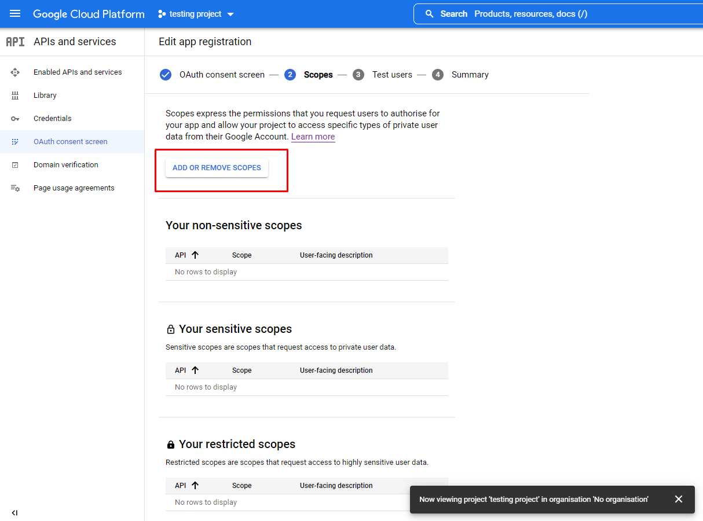

<h1>Will Bosley Third Year Project 2022: Scheduler</h1>
<h2>SETTING UP THE SCHEDULER</h2>
If you do not already have the files, download SourceCode.zip and unzip the folder. If you are marking this project, you will find SourceCode.zip within my submission.

To set up the scheduler, a Google Cloud Platform project must be created with the Google Calendar API enabled. Then a Google Calendar API CLIENT ID (AKA OAuth client ID) and API KEY must be created.
 

<h4>Getting your Client ID and API key.</h4>

To obtain an API key and a Client ID, it is necessary to complete the bullet points under the heading "Prerequisites" within Google's JavaScript Quickstart tutorial, available at the link below. Upon completing these four bullet points, which have been outlined in red, in the image below, you should have access to your CLIENT ID and your API KEY. Although Python 2.4 or greater can be used to run a web server for the project, it would be preferable to have a version of Python 3 installed for this project. If you are having issues setting up, I have written advice for some of the more confusing parts below. 

Google's JavaScript Quickstart tutorial can be found here: https://developers.google.com/calendar/api/quickstart/js

<i>PLEASE NOTE: When you are  creating your Oauth Client ID credentials, you will be prompted to configure your OAuth consent screen, scopes, and test users. There are a couple of specific things that need to be done during these stages:</i>

During the "scopes" stage, you need to make sure to add the Google Calendar API scope. Instructions to do this are as follows:

Press the "add or remove scopes" button, outlined in red in the image above, to start manually adding a scope.

You then need to select the scope ``https://www.googleapis.com/auth/calendar`` from the table of scopes which appears. If this scope is not there, enter ``https://www.googleapis.com/auth/calendar`` into the text box outlined in red in the image above and press "add to table".

Once you have found the ``https://www.googleapis.com/auth/calendar`` scope in the table, tick the check box that will be on the left of its row, and press "update". The scope, with the checkbox ticked, is outlined in red in the image above.

On the next screen, you will be prompted to add test users. Be sure to add the Google account that you will be using the application with as a test user, so you can use the app.

<h4>Customising the code.</h4>

Once your API Key and Client ID have been obtained, open index.html from inside the SourceCode folder and replace the values of the CLIENT_ID and API_KEY variables with your own client id and api key. These variables are initialized on lines 1865 and 1866 within index.html. Change the values of these variables from "XXXX" to (Your API Key/ Client ID). An image of the variables within index.html that need editing is below.

After placing your own Client ID and API key into the file, go to lines 1899-1903 in index.html, and there should be a function named initClient. In order for your client ID and your API key to work, a small edit needs to be made here.

Find the section outlined in red in the image above within the initClient function in index.html. Directly after the word 'SCOPES' on line 1903, type a comma, press enter to go to a new line, and type  'plugin_name: "scheduler"'. Afterwards, the text in your function should look like the image below. The edited section has been outlined in red, and the new line of code you need to type has a red arrow pointing at it. Please do not forget to type the comma after the word 'SCOPES'.

After you have done this, navigate to line 1858 in index.html. There will be a line of code that reads ````. This line of code has been outlined in red in the image below.

This line of code needs to be deleted for the scheduler to run. The image below shows what that section of text will look like after the line has been deleted. Please delete the line of code.

After you have made these edits to index.html, navigate to the directory named SourceCode using the Windows Command Prompt (cmd) , and run this command if you have a version of Python 3 installed:

``python -m http.server 8000``

...or this command if you have a version of Python 2 installed:

``python -m SimpleHTTPServer 8000``

...however, this project has not been tested using Python 2, so there may be errors if using Python 2. Please try to use the project using a version of Python 3.

These lines of code start a very basic Python web server that will be hosting index.html. Once the Python server is running, go to http://localhost:8000 in your web browser and the scheduler should be available to use.

If upon correctly completing the steps above and navigating to http://localhost:8000, there are any error messages at the bottom of the screen, please refer to the Google Quickstart tutorial's [troubleshooting](https://developers.google.com/calendar/api/quickstart/js#:~:text=the%20sample%20section.-,Troubleshoot%20the%20sample,-This%20section%20describes) section.  A common error that can occur is the message ``idpiframe_initialization_failed: Not a valid origin for the client`` appearing at the bottom of the scheduler's web page. Advice for fixing this error can be found at the bottom of this readme file.

Having tested this process myself using a new Google account, I understand that Google's tutorials can be a bit vague. I understand this is a lengthy setup process. If you are having any trouble setting this up or need any advice, please email me at W.Bosley@uea.ac.uk, I am more than happy to help.

<h2>USING THE SCHEDULER</h2>

<h4>Scheduling tasks.</h4>

First, log in using a Google account by pressing the "authorize" button in the upper left corner. The position of the authorize button on the page has been outlined in red in the image below.

Once you have logged in, you can start scheduling tasks. To add a task, fill in its details in the "form for adding tasks" on the left hand side of the page. When you have specified the task you want scheduled, press the "create task" button at the bottom of the form. If you want to input another task, change the details in the form to the details of your next task and press "create task". 

<i>PLEASE NOTE: In this version, the decription of the task you are inputting is used by the scheduler to identify it in your Google Calendar. Please refrain from using the same descriptions for multiple tasks, or some processes my function incorrectly. This will be changed in the next update.</i>

An image of this form can be seen below:

<i>PLEASE NOTE: the boxes outlined in red in the image are used for testing, and have no function here, so please do not attempt to fill them in.</i>

Once you've submitted all the tasks you want scheduling, press "schedule tasks" to schedule these to your Google Calendar.

<h4>Setting work hours.</h4>

The default work hours within which tasks will be scheduled for this project is 9am to 5pm. If you want to set custom work hours, fill in the central form with the hours that suit you best. After typing in your work hours and pressing "set work hours", these work hours should be applied next time you generate a schedule by pressing "Schedule tasks" this session. An image of the form for setting your work hours can be seen below.

<h4>Setting breaks.</h4>

The form on the right labelled "Form for adding breaks" can be used to add breaks into your next schedule. To add a break, fill in the form with the details of your desired break and press "create break". To add multiple breaks, change the details that you previously entered into the break form and press "create break" again. These breaks will be applied to your generated schedule when you press "schedule tasks". The break form can be seen below.

<i>NOTE: PLEASE DO NOT PRESS THE "Schedule break(s)" BUTTON. This is a button for testing, and will refresh your page and reset anything you have inputted into the website. The breaks you have submitted by pressing "create break" will be scheduled in automatically upon pressing "schedule tasks".</i>

Many apologies for the rough UI. Less focus was put on developing the visuals of the scheduler during development because we were determined to make this application as feature rich as possible within the time available.

<h4>Rescheduling tasks.</h4>

The scheduler has the ability to react appropriately if your plans change, and you need to regenerate your schedule. An example of a scenario like this would be if a user had previously generated a work schedule, and then found out later that they had a hospital appointment stopping them from completing a day’s work tasks. The program can regenerate the user’s schedule to fit in work events around their new calendar. It will reschedule all uncompleted work events in the gaps in the user’s updated Google calendar.

The steps to reschedule any previously scheduled, in progress tasks is as follows. Tick the "reschedule old tasks" button <b>prior</b> to pressing "schedule tasks". If you want to adjust the work hours, add any extra breaks, or upload any new tasks to go along with this reschedule, fill in the appropriate forms before pressing "schedule tasks". 

Please note that scheduling tasks may take a little time, as the Google Calendar API does not allow more than 10 requests per second for developers with free accounts. Please wait for your Google Calendar to update with your schedule before closing or refreshing the webpage. If your Google Calendar is not updating, please try refreshing the Google Calendar web page. (If you want to see the progress of event generation, scroll down to see messages appearing at the bottom of the screen one by one as your events are genarated. If you want to see the progress of event deletion, messages will appear one by one showing the responses to the shceduler's delete requests in your web browsers console. The web broswers console is commonly accessed by pressing F12.)

<h4>Bugs</h4>
Note: There are two bugs which are in the process of being fixed.

There is a bug which can appear when scheduling tasks. If the current time when the schedule takes place is within the user’s specified work hours, some events which are scheduled onto that date on the calendar may be erroneously scheduled in the past. For example, if it's lunchtime, events could be scheduled in the morning. These erroneously scheduled events may overlap with other calendar events which are positioned earlier in the day. Additionally, they obviously cannot be accomplished if they are in the past. Events which are being scheduled on the present day should of course only appear in the future. This bug will be fixed in the next update to the code on the Github.

As well as this, there were issues with the times of breaks always being interpreted by the scheduler as being in GMT.  This means that if a break is entered with a time of 1pm to 2pm while it is currently British Summer Time, the breaks will appear between 2pm and 3pm on the user’s calendar. A fix for this is in development.

<h4> ERROR: 'Not a valid origin for the client'</h4>
If you are recieving the error, ``idpiframe_initialization_failed: Not a valid origin for the client`` , it may be because http://localhost:8000 was not set as a JavaScript origin when setting up the client ID. Below is a fix you can try.

Open your project in the Google Cloud Platform, then open the menu in the top left and navigate to ``APIs and serices >> credentials``.

Click the pencil icon on your ClientID to edit it. An red arrow pointing to the button you should press is in the image above.

Under the heading "Authorised JavaScript origins", press "ADD URL". An image of the button you need to press is pointed at by a red arrow in the image above.

Next, add http://localhost:8000 as an authrorised JavaScript origin by typing it into the URL box, which can be seen in the image above, and saving your changes.

